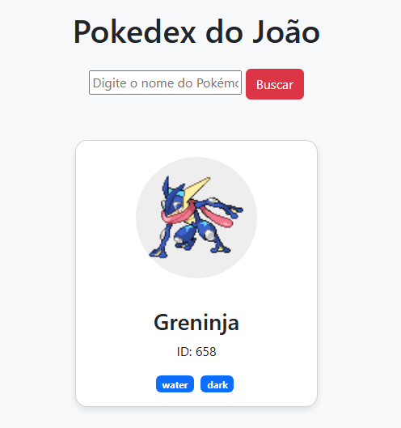

# 📑 PokeAPI Spring Boot Challenge
Este projeto é uma aplicação Full Stack desenvolvida para o desafio de consumo de APIs externas. A aplicação consulta a PokeAPI para exibir informações detalhadas sobre Pokémons, como ID, nome, tipos e sprites, utilizando uma interface web amigável.

🚀 Tecnologias Utilizadas
Java 21: Versão LTS mais recente para performance e segurança.

Spring Boot 4.0.4: Framework base da aplicação.

Spring Cloud OpenFeign: Utilizado para o consumo declarativo da API REST externa.

Thymeleaf: Engine de templates para renderização do front-end dinâmico.

Lombok: Para redução de código boilerplate (Getters, Setters, Builders).

Maven: Gerenciador de dependências e build.

🛠️ Funcionalidades
Busca por Nome: Interface de busca que aceita o nome de qualquer Pokémon.

Consumo de API Externa: Integração via Feign Client com a PokeAPI.

Tratamento de Exceções: Sistema preparado para lidar com nomes inválidos ou erros de conexão.

Interface Responsiva: Exibição dos dados em Cards estilizados com os tipos (elementos) do Pokémon.

🔧 Configuração e Execução
Pré-requisitos
JDK 21 instalado.

Maven instalado (ou uso do Maven Wrapper).

Uma IDE de sua preferência (recomendado: IntelliJ IDEA).

Passos para Rodar
Clone o repositório:

Bash
git clone https://github.com/seu-usuario/PokeAPI-SpringBoot-Challenge.git
Importe o projeto na sua IDE como um projeto Maven.

Execute a classe PokeApiSpringBootChallengeApplication.java.

Acesse no navegador:
http://localhost:8080/pokemon/pokedex

📂 Estrutura do Projeto
controller: Gerencia as rotas e o fluxo entre o Service e o Thymeleaf.

service: Contém a lógica de negócio e a PokemonFactory para conversão de dados.

dto: Classes de transferência de dados (Data Transfer Objects) para mapear o JSON da API.

client: Interface Feign para comunicação HTTP.

👤 Autor
João Victor Estudante de Ciência da Computação - Universidade Mackenzie LinkedIn | GitHub